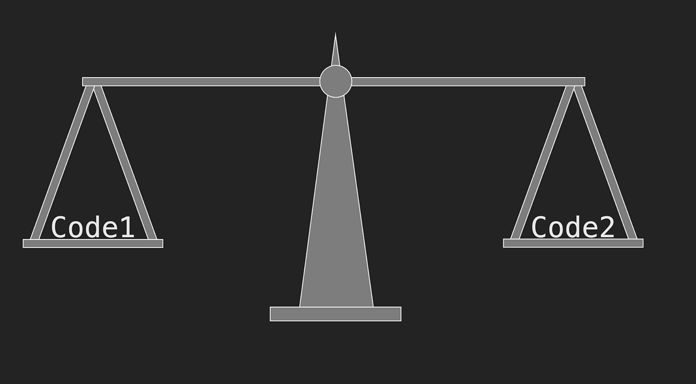

# 1 - Big O

## Introduction

- [Big O Pdf Notes](https://github.com/pravn27/ds-algo-tech-doc/blob/master/docs/ds-algo-course-tutorials/from-scott-barrett/readerDoc/1-big-o/Big%2BO%2BNotes.pdf)

- What is Big O ?

  - Assume we have 2 code base C1, C2 both are accomplish same thing (same functionality) but they are written differently
  - How to determine which one code base is better ? Big O
  - Big O is a way to mathematically figure out which of these two is better, which one runs more efficiently.

  

  - How do we measure Big O ?
    - Time complexity - Amount of time taken to run / execute the code base, depends on fast / slow computers / machines, so time complexity measures **with number of Operations**
    - Space complexity - Amount of memory uses while running executing teh code base

- Will focus mainly on Time complexity rather than Space complexity

## Big O: Worst Case

- Big O always measure with Worst Case scenarios / use case
- 3 scenarios
  - Best Case - Omega (Lower bound)
  - Average Case - Theta (tight bound)
  - Worst Case - Big O (Upper bound)

## Big O: O(n)

- Here, `n` represents the input size, and the number of operations grows proportionally with `n`.
- Example:

```
function logItems(n) {
  for (let i = 0; i < n; i++) {
    console.log(i);
  }
}

logItems(10);
```

.png>)
