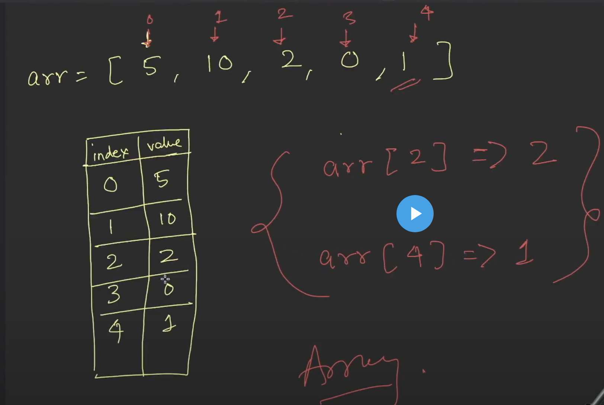
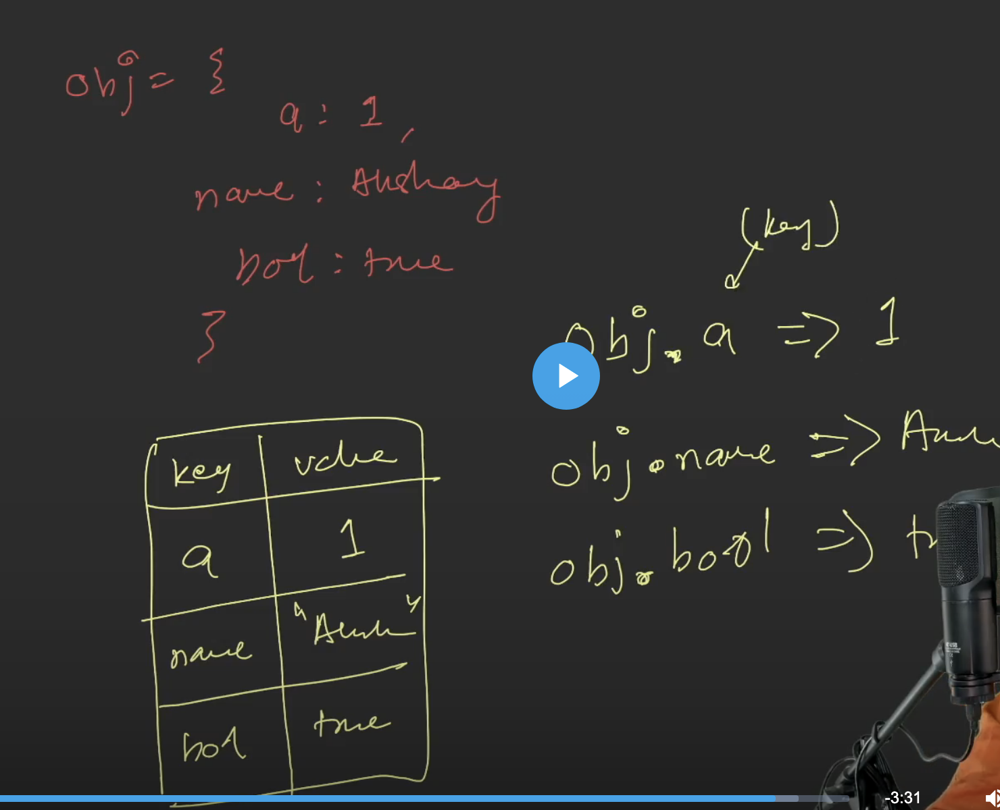

# 1 - Programming

> About Javascript programming fundamentals / basics

## JS Data structure

### Arrays

- Array elements stored in index values which starts from 0 by default. To define array index don't have a control

  

### Objects

- Objects are stored in key value pair

  

## DSA Interview guidance

- Steps to follow once get DSA problems
  - Understand problem statement completely with inputs, outputs
  - Try with sample inputs / outputs
  - Identify the pattern and Thought process to solve
  - Dry run with sample inputs, outputs along with your pseudo code
  - Implement / write code
  - Good to ask with Interviewer for what all edge case to cover
