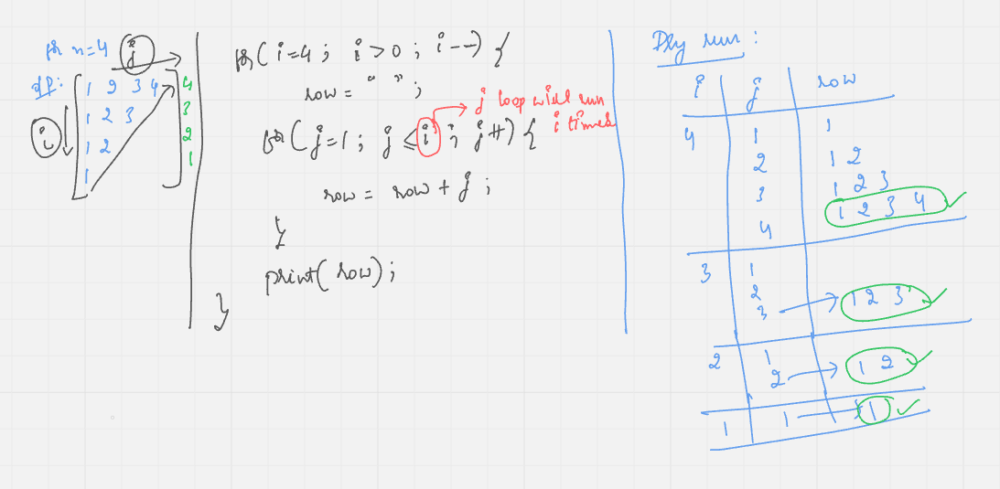
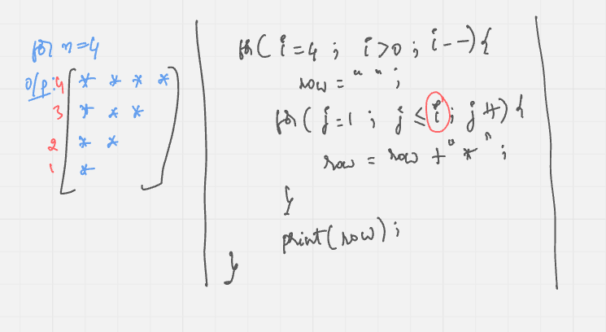
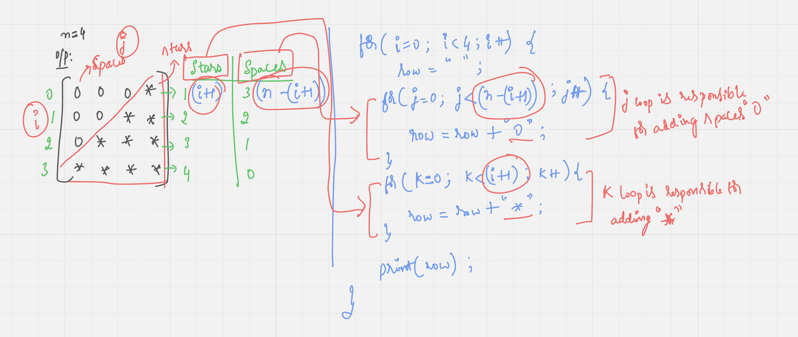
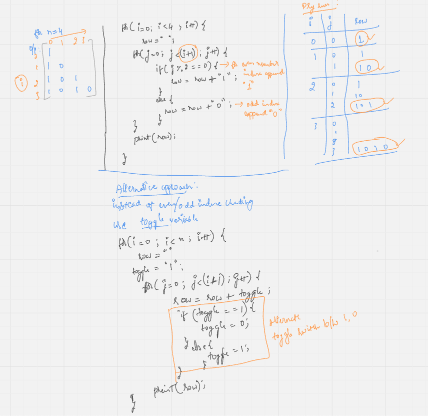
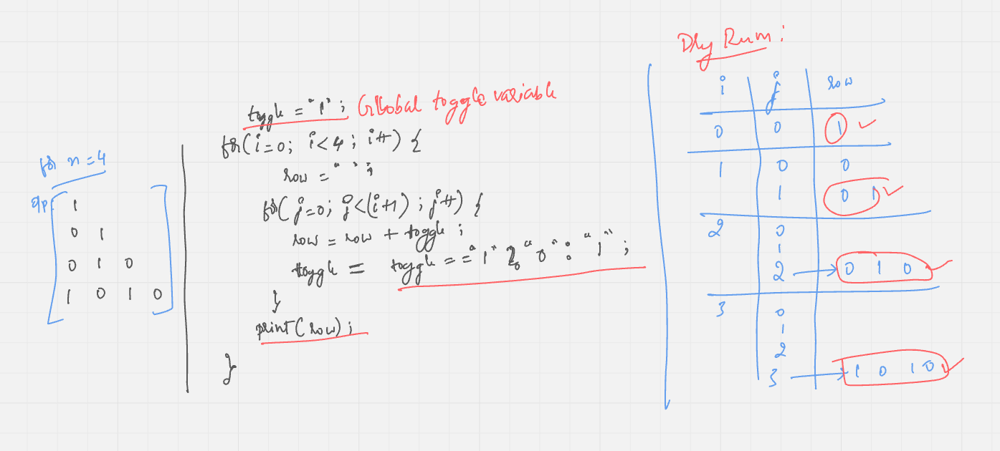

# 2 - Star Pattern

> Learn how to create various star-based patterns (pyramids, inverted patterns) using nested loops. A fun way to practice loops and understand iteration.

## Prerequisites to solve Star Pattern problem

    - Understanding Nested Loops (Loop within a Loop) is very important
    - Recap of Nested Loops
    

## Implement solutions

- https://github.com/pravn27/ds-algo-coding-challenge/tree/master/namaste-dsa/warm-up/star-pattern

## Star pattern - 1

## Star pattern - 2

- Right angled star triangle
- Similar like Star pattern - 1
  

## Star pattern - 3

- Right Angled Number Triangle
- Similar like Star pattern - 2
  

## Star pattern - 4

- Right-Angled Triangle of Repeated Numbers
- Similar like Star pattern - 3
  

## Star pattern - 5

- Reverse Right-Angled Triangle of Increasing Numbers
- Similar like Star pattern - 3, 4
  
- Similar, instead of numbers, should print star
  

## Star pattern - 6

- Right-Aligned Right-Angled Triangle of Stars
- Similar like Star pattern - 4, 5
  

## Star pattern - 7

- Right-Angled Triangle of Alternating 1s and 0s
- Similar like Star pattern - 5, 6
  

## Star pattern - 8

- Right-Angled Triangle of Alternating 1s and 0s (Global Toggle)
- Similar like Star pattern - 7
  
