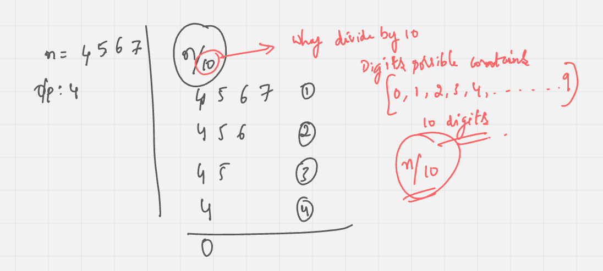

# 3 - Count Digit

> This episode teaches how to count digits in a number using loops and mathematical operations. It enhances your understanding of basic number manipulation.

## Problem & Implementation solution

- Write a function countDigits(n) that takes an integer n and returns how many digits it contains.
- https://github.com/pravn27/ds-algo-coding-challenge/tree/master/namaste-dsa/warm-up/count-digit

### Algorithm / Approach

- 
