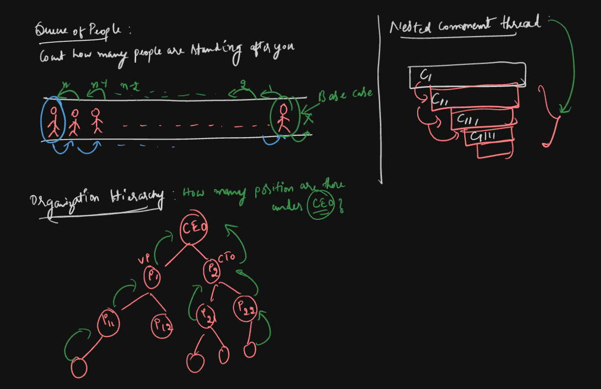

# 4 - Recursion

> This video introduces you to the concept of recursion, explaining how a function can call itself and when to use this technique for solving problems.

## What is Recursion

- Recursion is **Function calls itself to solve smaller version of the same problem.**
- **2 main important parts of Recursion**
  - **Base case** - stop / termination condition (when to stop calling itself)
  - **Recursive case** - where function calls itself

## Real life examples of Recursion usage

- Queue of people
- Nested Comment threads
- Organizational hierarchies structure

Examples:

Stopped at 55 min
